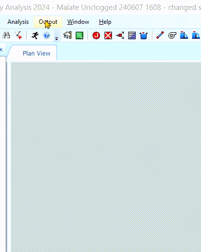
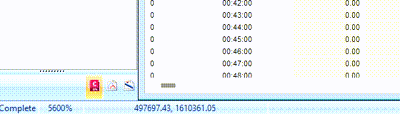
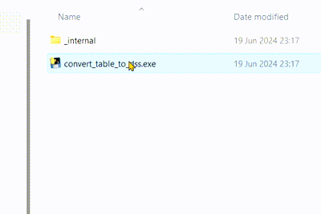

# Convert SSA results to DSS
This project converts SSA results tables into DSS files. The resulting DSS file will inherit the basename of the table file but with a ".dss" extension code.

## 🧑🏽‍💻 Author
### Ned Santiago  📞+63 (917) 890 5173  ✉️ [nedsantiago@tutanota.com](mailto:nedsantiago@tutanota.com)

## 🎯 Purpose
This github project was made for Hydrologists working with SSA. Specifically, for acquaintances needing to move data from Autodesk Storm and Sanitary Analysis (SSA) to Hydrologic Engineering Center's River Analysis System (HEC-RAS).

## ⚡Usage
### For exporting flooding flow rate data
1) While results are displayed in SSA, export data to a table file: In SSA, Output > Time Series Table by Variable

<div style="text-align: center">
  
</div>

2) Select the appropriate data, then press ok. Right-click on the table and export as table.

<div style="text-align: center">
  
</div>

3) Provide the name for the table.

<div style="text-align: center">
  
</div>


4) Run the executable file.
5) Select the table file.
6) It's done! The result should be in the same folder as the executable.

<div style="text-align: center">
  
</div>

## 📖 Documentation
### How to create the executable
This package requires PyInstaller and a terminal. PyInstaller is used to create an executable of `convert_table_to_dss.py`. First, install PyInstaller
```
py -m pip install pyinstaller
```
Second, locate the PyInstaller script. Using PyInstaller requires using the package itself (and not as a module). Thus, to compile the code:
```
pyinstaller ./src/convert_table_to_dss.py
```
The executable is located at 
```
./dist/convert_table_to_dss/convert_table_to_dss.exe
```